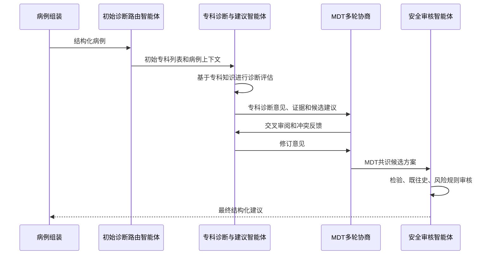

# 本科毕业论文成熟架构设计

## 1. 论文题目建议

建议题目：

**基于 MIMIC-IV v4 的多专科临床知识库构建与多智能体辅助诊疗系统研究**

备选题目：

- **面向多专科住院病例的临床知识库构建与智能体协同决策研究**
- **基于真实世界电子病历数据的多专科知识增强型辅助诊疗系统设计与实现**
- **融合 MIMIC-IV 数据治理与多智能体框架的临床辅助决策系统研究**

最推荐第一个题目，因为它能同时覆盖本项目的三个核心：MIMIC-IV 数据、六专科知识库、多智能体辅助诊疗。

## 2. 研究背景

真实临床住院病例往往不是单一疾病，而是多个系统疾病、慢性基础病、急性并发症和用药风险同时存在。传统单专科知识库难以覆盖多专科病例的交叉问题，而直接使用大语言模型又存在幻觉、证据来源不明确、缺乏结构化安全审核等问题。

MIMIC-IV v4 提供了诊断、处方、检验、生命体征、ICU、操作、微生物和结局等真实世界临床数据，适合用于构建可复现的数据处理流程和临床知识库。本课题以 MIMIC-IV v4 为数据基础，将住院病例按照六个临床专科进行结构化分层，构建多专科知识库，并进一步设计多智能体辅助诊疗框架，使系统能够在多专科病例中完成诊断路由、专科评估、多轮协商、共识方案生成和安全审核。

本研究的定位不是替代医生，而是构建一个**数据可追溯、知识可解释、流程可复现、安全可审核**的辅助诊疗原型系统。

## 3. 研究目标

本课题的总体目标是：基于 MIMIC-IV v4 真实世界住院数据，构建覆盖多维临床因素的六专科知识库，并设计一个知识增强型多智能体辅助诊疗系统。

具体目标包括：

1. 构建成人住院病例队列，形成可复现的数据预处理流程。
2. 基于 ICD 诊断和诊断文本规则，将病例映射到六个目标专科。
3. 综合人口学、诊断、既往史、合并症、全量首 24 小时检验、生命体征、用药、操作、微生物、ICU 和结局等因素，生成成熟病例特征表。
4. 使用单专科病例构建专科诊断知识、药物治疗知识、检验解释知识、病药共现映射和风险规则。
5. 使用多专科病例搭建诊断路由、专科诊断评估、专科建议、MDT 多轮协商、共识方案生成和安全审核流程。
6. 从数据质量、知识库质量和智能体输出质量三个层面进行实验评价。

## 4. 研究问题

论文可以围绕以下研究问题展开：

1. 如何从 MIMIC-IV v4 中构建可复现的多专科住院病例队列？
2. 如何将诊断、药品、检验和临床风险因素组织为可解释的六专科知识库？
3. 如何设计多智能体框架，使不同专科智能体能够协同处理复杂病例？
4. 如何通过风险规则和结构化病例特征减少辅助诊疗建议中的安全风险？
5. 如何评价知识库覆盖情况、多专科病例复杂度和智能体输出质量？

## 5. 技术路线

整体技术路线如下：

## 6. 项目文件对应关系

本课题不是纯理论设计，已经在项目中形成了相应实现。

数据预处理相关文件：

- `sql/01_extract_mimiciv_v4_cohort.sql`：基础队列、诊断、处方、首 24 小时检验和专科分层。
- `sql/02_mature_clinical_features_navicat.sql`：成熟临床特征，包括既往史、合并症、生命体征、操作、微生物、ICU 和结局。
- `sql/03_optimized_first24h_vitals_navicat.sql`：优化版生命体征抽取，避免 `chartevents` 长时间全表扫描。
- `sql/04_run_remaining_after_cancel_navicat.sql`：在原脚本中断后继续生成剩余表。
- `sql/05_extract_all_first24h_labs_navicat.sql`：抽取入院后首 24 小时全部数值型检验，形成全量检验长表和覆盖率表。
- `preprocess_mimiciv_v4.py`：连接 PostgreSQL、执行 SQL、导出 CSV 和字段校验。
- `docs/preprocessing_protocol.md`：数据预处理方法说明。
- `docs/thesis_design_and_preprocessing_solution.md`：预处理优化、Navicat 执行和毕设思路说明。

知识库相关文件：

- `build_specialty_kb.py`：构建六专科知识库。
- `knowledge_base/`：六专科知识库输出目录。
- `draw_kb_figures.py`：绘制知识库统计图。
- `draw_processed_data_figures.py`：绘制处理后数据分布图。
- `draw_raw_vs_processed_comparison.py`：绘制清洗前后对比图。

多智能体相关文件：

- `experiments/case_builder.py`：将 CSV 组装为智能体输入病例。
- `experiments/schemas.py`：定义病例、推荐、风险和对话消息等结构。
- `experiments/diagnosis_agent.py`：诊断路由智能体。
- `experiments/specialty_agent.py`：专科智能体。
- `experiments/mdt_discussion_agent.py`：MDT 多轮协商与共识生成模块。
- `experiments/coordination_agent.py`：旧版协调模块，保留用于历史对照，当前主流程不再使用。
- `experiments/safety_agent.py`：安全审核智能体。
- `experiments/run_multi_agent_dialogue.py`：多智能体实验入口。

## 7. 数据来源与队列构建

### 7.1 数据来源

数据来源为 MIMIC-IV v4 数据库。该数据库包含住院患者的人口学信息、入出院信息、诊断编码、处方、检验、ICU 记录、生命体征、操作、微生物和结局等数据。

本项目主要使用以下数据表：

- `patients`：患者基本信息。
- `admissions`：住院记录。
- `diagnoses_icd`：ICD 诊断。
- `d_icd_diagnoses`：ICD 诊断字典。
- `prescriptions`：处方用药。
- `labevents`：检验结果。
- `d_labitems`：检验项目字典。
- `icustays`：ICU 停留记录。
- `chartevents`：ICU 生命体征和护理记录。
- `d_items`：ICU 项目字典。
- `procedures_icd`：ICD 操作。
- `d_icd_procedures`：ICD 操作字典。
- `microbiologyevents`：微生物培养和药敏结果。

### 7.2 分析单位

分析单位为一次住院，即 `hadm_id`。患者身份由 `subject_id` 表示，同一患者可能存在多次住院。历史住院记录用于提取既往病史，本次住院记录用于构建当前病例。

### 7.3 纳入标准

纳入标准：

1. 成人患者，`anchor_age >= 18`。
2. 存在有效 `subject_id` 和 `hadm_id`。
3. 入院时间 `admittime` 和出院时间 `dischtime` 完整。
4. 出院时间晚于入院时间。
5. 至少存在一个可映射到六个目标专科之一的诊断。

### 7.4 排除标准

排除标准：

1. 儿科病例。
2. 入院或出院时间缺失。
3. 住院时间异常。
4. 无法映射到目标专科范围的病例。
5. 诊断名称和 ICD 信息均无法有效解释的记录。

## 8. 六专科分层设计

本课题选择六个临床常见且与住院用药、检验风险和多系统疾病密切相关的专科：

1. 心血管。
2. 神经。
3. 呼吸。
4. 肾内/泌尿。
5. 内分泌/代谢。
6. 消化。

分科依据包括 ICD 编码前缀和诊断英文标题关键词。ICD 前缀提供可审计的医学编码依据，关键词用于补充部分诊断文本中具有明确专科指向但编码边界不够直接的情况。

根据每次住院命中的专科数量，将病例分为：

- 单专科病例：`specialty_cnt = 1`，用于构建相对纯净的专科知识库。
- 多专科病例：`specialty_cnt >= 2`，用于多智能体协同诊疗实验。

这种设计符合论文逻辑：先用单专科病例沉淀专科知识，再用多专科病例验证协同能力。

## 9. 数据预处理方案

### 9.1 总体原则

医疗数据预处理遵循以下原则：

1. 所有特征围绕 `subject_id` 和 `hadm_id` 对齐。
2. 能限定时间窗的变量尽量限定在入院早期，减少数据泄露。
3. 既往病史与本次合并症分开处理。
4. 缺失值不随意插补，而是保留为空并报告覆盖率。
5. 结局变量只用于评价，不作为智能体早期推荐输入。
6. 首 24 小时检验异常解释为入院早期基线风险，不解释为候选药物导致的异常。
6. 对超大表采用分段执行、先筛 itemid、物化中间表和建立索引的策略。

### 9.2 人口学与入院信息

人口学信息来自 `patients`，入院信息来自 `admissions`。保留字段包括：

- `subject_id`
- `hadm_id`
- 性别
- 年龄
- 入院时间
- 出院时间
- 入院类型
- 入院来源
- 出院去向
- 保险
- 语言
- 婚姻状态
- 种族
- 院内死亡标志

这些字段构成病例的基础背景。

### 9.3 当前诊断

当前诊断来自 `diagnoses_icd` 和 `d_icd_diagnoses`。保留 ICD 版本、ICD 编码、诊断顺序和诊断名称。

主诊断定义为 `seq_num` 最小的诊断。其他诊断作为本次住院合并症，用于描述病例复杂度。

### 9.4 既往病史

既往病史不直接使用本次住院非主诊断，而是回溯同一 `subject_id` 在本次入院前的历史住院诊断。

当前设计提取以下慢性病标志：

1. 高血压。
2. 糖尿病。
3. 心力衰竭。
4. 冠心病。
5. 卒中。
6. COPD。
7. 慢性肾病。
8. 慢性肝病。
9. 恶性肿瘤。

这种处理更符合医学论文中“既往病史”的定义，可以避免把本次急性并发症误当作既往病史。

### 9.5 合并症

合并症来自本次 `hadm_id` 的非主诊断。输出包括合并症数量、合并症列表和涉及专科列表。

合并症用于描述病例复杂度，也可用于多智能体路由和安全审核。

### 9.6 检验指标

检验来自 `labevents` 和 `d_labitems`，限定时间窗为入院后首 24 小时。为了避免只关注少数指标造成信息损失，本研究采用“双层检验设计”：

第一层是**全量检验层**。保留首 24 小时内所有具有数值结果的检验项目，按 `subject_id`、`hadm_id`、`itemid` 和检验名称形成长表，记录检验次数、首次值、末次值、最小值、最大值、均值和单位。该层用于描述病例全貌、统计检验覆盖率，以及为后续扩展新的风险规则提供基础。

第二层是**关键风险指标层**。在全量检验基础上，额外派生与安全审核直接相关的关键指标，包括：

- 肌酐。
- 尿素氮。
- 钾。
- 钠。
- 血糖。
- INR。
- 总胆红素。

风险方向处理：

- 肌酐、尿素氮、钾、血糖、INR、总胆红素取首 24 小时最大值。
- 钠取首 24 小时最小值。

这个口径适合早期风险筛查，但论文中要说明它不是均值或末次值。也就是说，论文方法中应写明：**预处理阶段关注全部检验，风险规则阶段只选择部分与药物安全和多专科决策高度相关的关键指标**。

### 9.7 生命体征

生命体征来自 ICU `chartevents`，包括：

- 心率。
- 呼吸频率。
- 体温。
- SpO2。
- 收缩压。
- 舒张压。
- 平均动脉压。

每项保留首 24 小时最小值、平均值和最大值。由于 `chartevents` 是超大表，项目提供了 `sql/03_optimized_first24h_vitals_navicat.sql`，先筛生命体征 itemid，再筛研究队列 ICU stay，最后生成生命体征表。

论文中要说明：非 ICU 病例可能缺少结构化生命体征，因此需报告覆盖率。

### 9.8 用药

用药来自 `prescriptions`。处理方式包括：

1. 保留原始处方记录，形成清洗前对照。
2. 去除空药名。
3. 合并多余空格。
4. 统一药品名称大小写。
5. 按 `subject_id`、`hadm_id` 和 `drug_name` 聚合，记录首次用药时间、末次停止时间和原始处方记录数。

知识库构建时，使用单专科病例统计药品频次，并通过治疗角色分层标注疾病直接治疗药、风险控制药、支持/对症治疗药、住院通用药物和低优先级药物。

### 9.9 操作与治疗

操作来自 `procedures_icd` 和 `d_icd_procedures`。重点提取：

- 操作数量。
- 机械通气标志。
- 肾脏替代治疗标志。
- 输血标志。
- 侵入性置管标志。
- 操作列表。

这些变量可用于描述病例严重程度和治疗复杂度。

### 9.10 微生物

微生物来自 `microbiologyevents`。提取内容包括：

- 微生物记录数。
- 是否培养阳性。
- 病原体数量。
- 是否存在耐药结果。
- 标本类型列表。
- 病原体列表。

微生物因素适合用于感染相关病例的背景描述和安全审核。

### 9.11 ICU 因素

ICU 信息来自 `icustays`，包括：

- 是否进入 ICU。
- ICU stay 数量。
- 首次 ICU 入科时间。
- 末次 ICU 出科时间。
- ICU 总时长。

ICU 因素用于描述病例严重程度和住院复杂度。

### 9.12 结局指标

结局指标包括：

- 院内死亡。
- 住院时长。
- 30 天再入院。

结局变量只能用于结果分析和模型评价，不应作为智能体早期辅助诊疗输入，否则会造成数据泄露。

## 10. 预处理输出表

基础必需表：

1. `cohort_admissions.csv`
2. `cleaned_diagnosis_specialty_detail_6.csv`
3. `cleaned_prescriptions.csv`
4. `cohort_first24h_labs.csv`
5. `cohort_first24h_labs_all_long.csv`
6. `cohort_first24h_labs_coverage.csv`
7. `single_specialty_cases.csv`
8. `multi_specialty_cases_v2.csv`
9. `specialty_top_diagnoses_clean.csv`
10. `specialty_top_drugs_clean.csv`

成熟临床特征表：

1. `case_summary_mature.csv`
2. `past_history_flags.csv`
3. `comorbidity_summary.csv`
4. `cohort_first24h_vitals.csv`
5. `procedure_features.csv`
6. `microbiology_features.csv`
7. `icu_features.csv`
8. `outcome_features.csv`

论文正文重点使用 `case_summary_mature.csv`，其他分表用于方法说明、覆盖率统计、附录和答辩追溯。

## 11. 知识库设计

### 11.1 知识库总体结构

知识库以六个专科为单位组织，每个专科对应一个目录：

- `knowledge_base/cardiology`
- `knowledge_base/neurology`
- `knowledge_base/respiratory`
- `knowledge_base/nephrology`
- `knowledge_base/endocrinology`
- `knowledge_base/gastroenterology`

每个专科目录包含：

- `disease_catalog.csv`
- `drug_catalog.csv`
- `lab_profile.csv`
- `risk_rules.json`
- `disease_drug_map.csv`
- `example_cases.json`

### 11.2 专科诊断知识

疾病知识采用**专科相关性与证据分层**，不简单判断一个疾病是否“核心”，而是说明该诊断与专科智能体决策之间的关系。

疾病目录来自 `specialty_top_diagnoses_clean.csv`，对每个专科统计高频诊断，并根据 ICD 章节、诊断名称、出现频次和专科临床意义标注为：

- `primary_specialty_disease`：本专科主要诊治疾病，可作为专科诊断评估的直接依据。
- `specialty_related_condition`：与本专科密切相关的并发症或重要临床状态，可影响治疗和风险判断。
- `cross_specialty_comorbidity`：跨专科合并症，需要提示其他专科智能体在 MDT 协商中共同审阅。
- `low_relevance_or_noise`：与本专科关系较弱或主要为编码噪声，仅保留用于追溯，不作为推荐依据。

这样设计比“核心/背景/剔除”更适合医学论文，因为它不是简单删除信息，而是说明每类诊断在专科智能体中的用途。专科智能体在诊断阶段会先读取本专科诊断知识，判断当前病例哪些诊断属于本专科主问题，哪些属于相关并发症，哪些需要交由其他专科处理。

### 11.3 药物目录

药物目录基于单专科病例与清洗后处方表生成，并采用**治疗角色分层**：

- `disease_directed_therapy`：直接针对本专科疾病治疗的药物。
- `risk_modifying_therapy`：影响疾病风险或并发症风险的药物，例如抗凝、降压、利尿、降糖等。
- `supportive_or_symptomatic_therapy`：支持和对症治疗药物。
- `general_inpatient_medication`：住院通用药物或溶媒类项目。
- `low_priority_or_uncertain`：证据不足或与本专科关系不明确的药物。

这种分层能支持更细致的专科智能体推理：专科智能体不只是给出药物清单，还需要说明药物是用于疾病直接治疗、风险控制，还是仅为支持治疗。

### 11.4 检验知识与检验画像

检验知识不应只覆盖少数关键指标。本研究将检验知识分为两层：

第一层为全量检验画像，基于 `cohort_first24h_labs_all_long.csv` 统计各专科病例中所有数值型检验项目的覆盖率、均值、中位数和分位数。

第二层为关键风险指标画像，针对与药物安全和多专科决策密切相关的肌酐、尿素氮、钾、钠、血糖、INR、总胆红素等指标，建立风险解释规则。

每个检验指标统计：

- 非空数量。
- 均值。
- 中位数。
- 第 25 百分位数。
- 第 75 百分位数。
- 覆盖率。
- 单位和检验项目来源。

检验画像用于描述不同专科病例的实验室特征，也为专科诊断评估和安全审核提供数据背景。

### 11.5 病药映射

病药映射基于单专科病例中诊断和药品的同次住院共现关系生成。系统对每个专科主要疾病和专科相关临床状态统计高频共现药品，并结合治疗角色分层区分疾病直接治疗、风险控制、支持治疗和低优先级药物。

论文中必须说明：病药共现不代表因果疗效，只是从真实世界用药模式中提取候选证据。

### 11.6 风险规则

风险规则以 JSON 形式存储，主要根据检验异常触发安全提示。例如：

- 肾功能异常提示药物剂量和肾毒性风险。
- 钾异常提示心律失常风险。
- INR 升高提示出血风险。
- 胆红素升高提示肝功能风险。

风险规则用于专科智能体和安全审核智能体：专科智能体在诊断评估阶段解释入院早期异常检验的临床意义，安全审核智能体在方案筛查阶段评估候选方案是否适合当前基线风险背景。风险规则不用于判断候选药物导致检验异常，也不用于替代临床指南。

## 12. 多智能体框架设计

### 12.1 总体框架

多智能体系统由四类核心模块组成：

1. 初始诊断路由智能体。
2. 专科诊断与建议智能体。
3. MDT 多轮协商与共识生成模块。
4. 安全审核智能体。

运行入口为 `experiments/run_multi_agent_dialogue.py`。

整体流程：

### 12.2 病例组装

`CaseBuilder` 读取多专科病例、入院信息、诊断、检验、生命体征、既往史、合并症、操作、微生物、ICU 和结局特征，并组装为 `CaseRecord`。

`CaseRecord` 包括：

- 患者基本信息。
- 主诊断。
- 涉及专科。
- 专科诊断映射。
- 合并症列表。
- 全量检验摘要与关键风险指标。
- 既往病史。
- 生命体征。
- 操作因素。
- 微生物因素。
- ICU 因素。
- 结局因素。

结局因素只用于实验记录、病例描述和结果评价，不进入专科智能体的早期诊断评估与建议生成提示，以避免数据泄露。

### 12.3 初始诊断路由智能体

初始诊断路由智能体只负责**初筛**，不承担最终专科诊断判断。它根据病例中的 `specialty_list`、诊断映射和专科数量判断需要唤起哪些专科，并给出初步主导专科。

它解决的问题是：当前病例应该交给哪些专科智能体进一步评估。这样可以避免单一总控模块承担诊断职责，也避免在缺少专科知识的情况下直接下结论。

### 12.4 专科诊断与建议智能体

专科智能体是本系统中最关键的推理单元。它不应只在路由之后直接给出药物推荐，而应先读取对应专科知识库，完成本专科视角下的诊断评估，再形成建议。

每个专科智能体读取的知识包括：

- 专科诊断知识：本专科主要疾病、相关并发症、跨专科合并症和低相关诊断。
- 药物治疗知识：疾病直接治疗、风险控制、支持治疗和住院通用药物。
- 全量检验画像：本专科病例中所有首 24 小时数值型检验的分布和覆盖率。
- 关键风险规则：肾功能、电解质、凝血、肝功能、血糖等风险解释。
- 病药共现证据：真实世界住院数据中诊断与药物的共现关系。

它输出：

- 本专科是否应参与该病例。
- 本专科相关诊断解释。
- 本专科主要问题判断。
- 支持诊断判断的检验、既往史、合并症和治疗证据。
- 推荐药物 TopK。
- 推荐理由。
- 风险提醒。
- 低优先级或应避免药物。
- 置信度。
- 专科总结。

因此，专科智能体承担的是“专科诊断评估 + 专科治疗建议”的双重任务。后续 MDT 协商只基于各专科意见形成共识，不替代专科智能体做诊断。

### 12.5 MDT 多轮协商与共识生成模块

本研究取消“单个协调智能体直接拍板”的设计，改为模拟真实 MDT 会诊的多轮协商机制。多个专科智能体先独立给出本专科诊断评估和初步建议，再进行交叉审阅，最后由共识生成模块形成候选方案。

MDT 协商分为三轮：

第一轮是专科独立评估。每个专科智能体基于本专科知识库判断自己是否应参与该病例、相关诊断是什么、主要问题是什么，并提出初步处理建议。

第二轮是交叉审阅。各专科智能体读取其他专科建议，对潜在冲突、重复建议、风险药物和优先级问题提出反馈。

第三轮是共识生成。系统根据各专科保留意见、交叉审阅反馈、初始主专科和候选建议得分，生成 MDT 共识方案、主专科优先修订方案和保守低冲突方案。

该模块需要处理：

- 各专科对病例主问题的判断是否一致。
- 哪些问题属于主专科，哪些属于并行处理的合并症。
- 多专科推荐重复。
- 不同专科用药冲突。
- 主次专科优先级。
- 多系统疾病下的综合治疗逻辑。

MDT 共识生成模块不直接从原始诊断做专科判断，而是基于各专科智能体输出的专科诊断评估进行整合。这一点更接近真实临床多学科会诊流程。

### 12.6 安全审核智能体

安全审核智能体采用“规则引擎 + 大模型安全审核技能”的混合机制。规则引擎先根据入院后首 24 小时检验、既往史、生命体征、操作治疗、微生物、ICU 暴露等信息识别患者基线风险；随后结合候选药物的潜在影响，对候选方案进行适配性复核，判断是否需要提示、监测、降权或人工复核。若配置了大模型接口，大模型安全审核技能会进一步综合患者指标、药物影响和专科意见进行复核。

它输出最终方案、排序方案、基线风险、方案适配提示、大模型安全复核意见和安全总结。需要强调的是，基线风险来自入院早期检验，不表示候选药物导致异常。若未配置大模型接口，系统自动退回规则型安全审核，保证实验流程可复现。

## 13. 实验设计

### 13.1 数据质量实验

统计内容：

- 成人住院队列规模。
- 六专科诊断覆盖情况。
- 单专科病例数量。
- 多专科病例数量。
- 首 24 小时检验覆盖率。
- 生命体征覆盖率。
- 既往病史阳性比例。
- 操作、微生物、ICU 和结局指标分布。

对应图表可以由 `draw_processed_data_figures.py` 和后续补充图表脚本生成。

### 13.2 知识库构建实验

统计内容：

- 各专科疾病目录数量。
- 专科主要疾病、专科相关状态、跨专科合并症和低相关诊断比例。
- 各专科药物目录数量。
- 疾病直接治疗药、风险控制药、支持/对症治疗药和住院通用药物比例。
- 病药映射质量分布。
- 风险规则数量。
- 示例病例数量。

对应图表由 `draw_kb_figures.py` 生成。

### 13.3 清洗前后对比实验

统计内容：

- 原始诊断记录与清洗后诊断记录对比。
- 原始处方记录与清洗后处方记录对比。
- 病例分层前后规模。
- 病药共现与结构化映射条目对比。

对应图表由 `draw_raw_vs_processed_comparison.py` 生成。

### 13.4 多智能体病例实验

选择若干多专科病例作为测试样例，运行 `experiments/run_multi_agent_dialogue.py`，观察：

- 路由智能体是否正确识别涉及专科。
- 专科智能体是否能调用对应知识库。
- MDT 多轮协商是否能识别冲突并形成共识方案。
- 安全审核智能体是否能识别风险。
- 输出是否结构化、可解释、可追溯。

## 14. 评价指标

### 14.1 数据预处理评价

评价指标：

- 队列病例数。
- 六专科覆盖率。
- 单专科与多专科比例。
- 检验覆盖率。
- 生命体征覆盖率。
- 既往病史完整性。
- 处方清洗前后记录数变化。

### 14.2 知识库评价

评价指标：

- 疾病目录数量。
- 药物目录数量。
- 专科相关性分层合理性。
- 治疗角色分层合理性。
- 全量检验覆盖率和关键风险指标覆盖率。
- 病药映射可直接使用比例。
- 风险规则覆盖专科数量。

### 14.3 智能体评价

评价指标：

- 初始专科路由合理性。
- 专科诊断评估完整性。
- 专科建议结构完整性。
- 诊断证据和推荐理由可解释性。
- 风险规则触发情况。
- 多专科方案协调能力。
- 输出稳定性。

由于本科毕设不一定要求严格临床验证，可以采用规则一致性、案例分析和专家可读性评价作为主要评价方式。

## 15. 系统实现架构

系统可以分为五层：

### 15.1 数据层

数据层包括 MIMIC-IV v4 PostgreSQL 数据库和导出的 CSV 文件。Navicat 用于 SQL 执行、表检查和 CSV 导出。

### 15.2 预处理层

预处理层包括基础队列构建、成熟临床特征提取和性能优化脚本。

对应文件：

- `sql/01_extract_mimiciv_v4_cohort.sql`
- `sql/02_mature_clinical_features_navicat.sql`
- `sql/03_optimized_first24h_vitals_navicat.sql`
- `sql/04_run_remaining_after_cancel_navicat.sql`
- `preprocess_mimiciv_v4.py`

### 15.3 知识库层

知识库层将预处理后的单专科病例转化为六专科知识文件。

对应文件：

- `build_specialty_kb.py`
- `knowledge_base/`

### 15.4 智能体层

智能体层实现诊断路由、专科诊断评估、MDT 多轮协商、共识生成和安全审核。

对应目录：

- `experiments/`

### 15.5 展示与实验层

展示与实验层包括图表、实验输出 JSON 和论文结果分析。

对应目录：

- `figures/`
- `experiments/outputs/`

## 16. 论文创新点

本科论文可以从以下角度概括创新点：

1. 构建了面向六专科住院病例的 MIMIC-IV 数据预处理流程。
2. 将既往病史、本次合并症、首 24 小时检验、生命体征、操作、微生物、ICU 和结局等多维因素纳入病例结构。
3. 基于单专科病例构建包含诊断知识、治疗知识和全量检验画像的可解释专科知识库，而不是直接依赖大模型生成知识。
4. 设计了专科诊断评估前置的多智能体协同辅助诊疗框架，使专科智能体先基于背景知识判断本专科问题，再进入 MDT 多轮协商。
5. 引入安全审核智能体，对检验异常和临床风险进行结构化筛查。

## 17. 论文局限性

需要主动说明以下局限：

1. MIMIC-IV 是单中心回顾性数据库，外部泛化能力有限。
2. ICD 编码和关键词映射可能存在误分或漏分。
3. 病药共现只能代表真实世界用药模式，不能代表治疗因果关系。
4. 既往病史只能覆盖 MIMIC-IV 中记录过的历史住院，不能覆盖院外未记录病史。
5. ICU 生命体征来自 `chartevents`，非 ICU 病例可能缺失。
6. 多智能体输出仍需临床专家审核，不能直接用于临床决策。

## 18. 推荐论文章节结构

### 第一章 绪论

内容包括研究背景、研究意义、国内外研究现状、研究内容和论文组织结构。

重点强调多专科住院病例复杂、电子病历数据价值、知识库与大模型结合的必要性。

### 第二章 数据来源与相关技术

内容包括 MIMIC-IV v4 数据库、ICD 编码、临床知识库、多智能体系统、大语言模型和数据预处理技术。

### 第三章 多专科病例队列构建与数据预处理

这是论文重点章节之一。内容包括成人队列、六专科映射、既往史、合并症、检验、生命体征、用药、操作、微生物、ICU 和结局。

### 第四章 六专科临床知识库构建

内容包括疾病目录、药物目录、检验画像、病药共现映射、风险规则和示例病例。

### 第五章 多智能体辅助诊疗系统设计

内容包括系统总体架构、病例组装、诊断路由智能体、专科诊断与建议智能体、MDT 多轮协商机制、安全审核智能体和输出结构。

### 第六章 实验结果与分析

内容包括数据预处理结果、知识库统计结果、清洗前后对比、多智能体案例分析和系统效果讨论。

### 第七章 总结与展望

内容包括研究总结、存在不足和后续改进方向。

## 19. 可直接写入论文的摘要草稿

随着电子病历数据和大语言模型技术的发展，基于真实世界临床数据构建可解释辅助诊疗系统成为医学信息学的重要研究方向。针对住院患者多疾病共存、多专科交叉和用药风险复杂的问题，本文基于 MIMIC-IV v4 数据库，设计并实现了一种多专科临床知识库构建与多智能体辅助诊疗框架。首先，以成人住院记录为研究对象，基于 ICD 诊断编码和诊断文本构建六专科病例队列，并从人口学、诊断、既往史、合并症、检验、生命体征、处方、操作、微生物、ICU 暴露和结局等多个维度进行结构化预处理。其次，利用单专科病例构建疾病目录、药物目录、检验画像、病药共现映射和风险规则，形成六专科临床知识库。最后，面向多专科病例设计诊断路由、专科诊断评估、MDT 多轮协商、共识方案生成和安全审核流程，实现知识库约束下的辅助诊疗原型。实验结果从数据覆盖、知识库结构和病例分析等方面验证了该框架的可行性。本文研究为真实世界电子病历数据在多专科辅助诊疗中的应用提供了一种可复现、可解释的实现思路。

## 20. 可直接写入论文的研究内容草稿

本文主要研究内容包括以下四个方面。

第一，构建 MIMIC-IV v4 成人住院病例队列。以 `hadm_id` 为分析单位，筛选成人住院患者，关联患者基本信息、入院信息、诊断、处方、检验、ICU、操作和微生物等数据表，形成统一病例索引。

第二，设计多维临床因素预处理流程。根据 ICD 编码和诊断文本将病例映射到心血管、神经、呼吸、肾内/泌尿、内分泌/代谢和消化六个专科，并进一步提取既往病史、本次合并症、首 24 小时检验、生命体征、用药、操作、微生物、ICU 暴露和结局指标。

第三，构建六专科临床知识库。基于单专科病例统计高频疾病和药物，结合专科相关性分层、治疗角色分层和真实世界共现证据，构建专科诊断知识、药物治疗知识、检验画像、病药共现映射和风险规则。

第四，设计多智能体辅助诊疗框架。针对多专科病例，构建诊断路由智能体、专科诊断与建议智能体、MDT 多轮协商模块和安全审核智能体，实现病例分派、专科独立评估、交叉审阅、共识方案生成和风险筛查。

## 21. 当前执行建议

根据目前项目状态，建议按以下顺序继续推进：

1. 在 Navicat 中执行 `sql/04_run_remaining_after_cancel_navicat.sql`，生成剩余成熟特征表和 `case_summary_mature`。
2. 导出 `case_summary_mature.csv`、`past_history_flags.csv`、`comorbidity_summary.csv`、`cohort_first24h_vitals.csv`、`procedure_features.csv`、`microbiology_features.csv`、`icu_features.csv` 和 `outcome_features.csv`。
3. 确认基础表 `single_specialty_cases.csv`、`multi_specialty_cases_v2.csv`、`cleaned_diagnosis_specialty_detail_6.csv`、`cleaned_prescriptions.csv`、`specialty_top_diagnoses_clean.csv` 和 `cohort_first24h_labs.csv` 已存在。
4. 运行 `build_specialty_kb.py` 重建知识库。
5. 运行三个绘图脚本生成论文图表。
6. 选择若干多专科病例运行 `experiments/run_multi_agent_dialogue.py`，生成案例分析结果。

## 22. 答辩时的核心表述

答辩时可以用一句话概括本项目：

本项目基于 MIMIC-IV v4 构建成人住院病例队列，围绕六个常见专科提取多维临床因素，利用单专科病例构建可解释知识库，再用多专科病例搭建诊断路由、专科诊断评估、MDT 多轮协商、共识方案生成和安全审核组成的多智能体辅助诊疗原型。

再用三句话解释价值：

第一，数据处理上不是简单清洗 CSV，而是按临床时间线和医学含义处理人口学、诊断、既往史、检验、用药、操作、微生物和结局。

第二，知识库不是人工凭空编写，而是来自 MIMIC-IV 单专科病例的频次统计、共现证据和规则标注。

第三，智能体不是直接让大模型自由回答，而是在知识库和风险规则约束下进行结构化协同决策。
