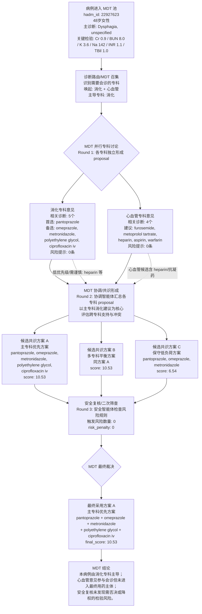

# cloud_mdt_case_0 MDT 会诊链路图

来源 JSON：`experiments/outputs/cloud_mdt_case_0.json`

> 说明：本图按 MDT（多学科会诊）链路重画，重点表达“召集 MDT -> 多专科并行意见 -> 协调共识 -> 安全复核 -> 最终方案”，而不是单向流水线。

## Mermaid MDT 链路图

## 简要解读

- 这不是“诊断 -> 专科 -> 安全”的普通流水线，而是一次简化 MDT 链路：先召集相关专科，再由专科并行给出意见，随后进入协调共识和安全复核。
- case 0 唤起 `消化` 与 `心血管`，主导专科为 `消化`。
- 协调阶段保留了消化专科方案作为最终主体；心血管建议参与讨论，但没有进入最终方案主体。
- 安全复核触发风险数量为 `0`，所以最终采用 `plan_a 主专科优先方案`。
