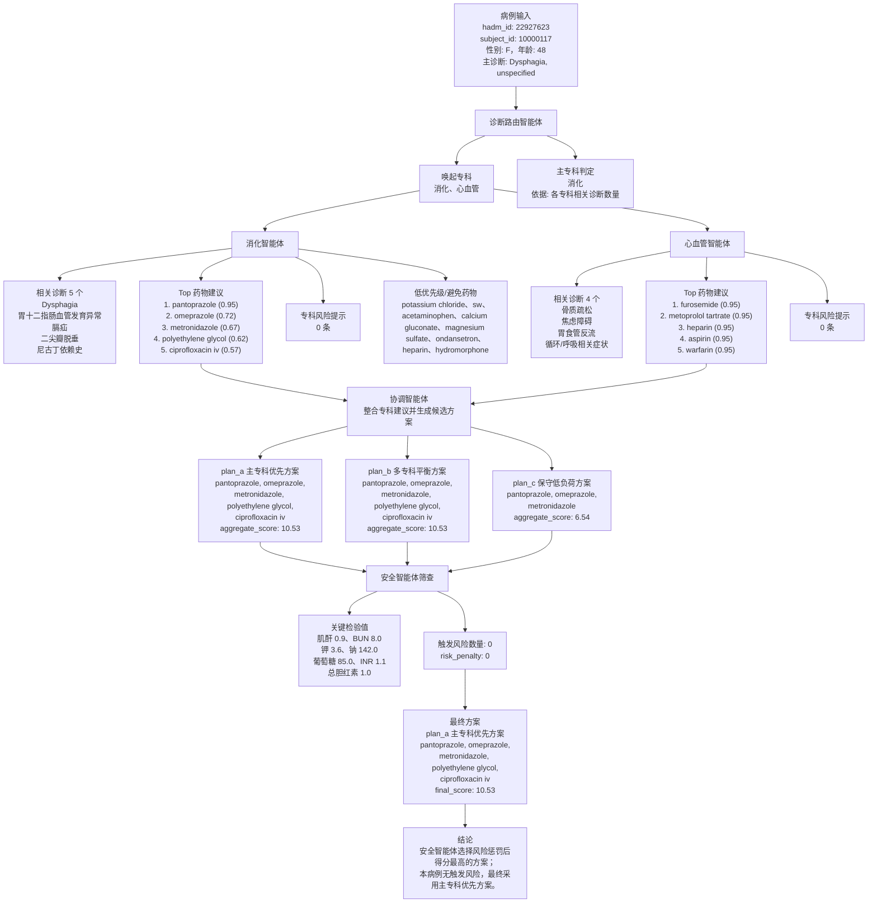

# cloud_mdt_case_0 整体结果流程图

来源 JSON：`experiments/outputs/cloud_mdt_case_0.json`

## Mermaid 流程图

## 简要解读

- 病例 `22927623` 被路由到 `消化` 和 `心血管` 两个专科，主专科为 `消化`。
- 消化智能体的推荐药物构成了最终方案主体。
- 安全智能体没有发现触发风险，因此候选方案未受到风险惩罚。
- `plan_a` 与 `plan_b` 得分相同，排序后最终选择 `plan_a 主专科优先方案`。
